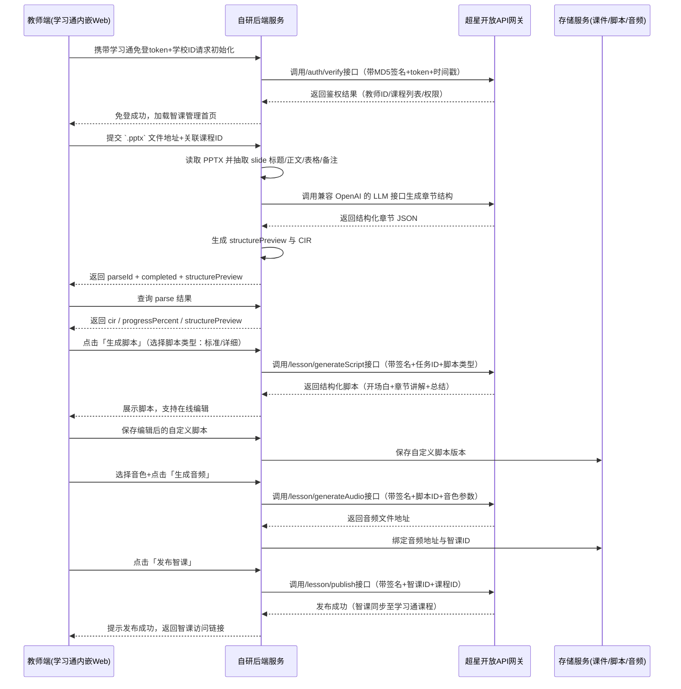

```mermaid
sequenceDiagram
    participant 教师端(学习通内嵌Web)
    participant 自研后端服务
    participant 超星开放API网关
    participant 存储服务(课件/脚本/音频)

    %% ========== 步骤1：学习通内打开应用（免登初始化） ==========
    教师端(学习通内嵌Web)->>自研后端服务: 携带学习通免登token+学校ID请求初始化
    自研后端服务->>超星开放API网关: 调用/auth/verify接口（带MD5签名+token+时间戳）
    超星开放API网关-->>自研后端服务: 返回鉴权结果（教师ID/课程列表/权限）
    自研后端服务-->>教师端(学习通内嵌Web): 免登成功，加载智课管理首页

    %% ========== 步骤2：提交 .pptx 并同步触发解析 demo ==========
    教师端(学习通内嵌Web)->>自研后端服务: 提交 `.pptx` 文件地址+关联课程ID
    自研后端服务->>自研后端服务: 读取 PPTX 并抽取 slide 标题/正文/表格/备注
    自研后端服务->>超星开放API网关: 调用兼容 OpenAI 的 LLM 接口生成章节结构
    超星开放API网关-->>自研后端服务: 返回结构化章节 JSON
    自研后端服务->>自研后端服务: 生成 structurePreview 与 CIR
    自研后端服务-->>教师端(学习通内嵌Web): 返回 parseId + completed + structurePreview
    教师端(学习通内嵌Web)->>自研后端服务: 查询 parse 结果
    自研后端服务-->>教师端(学习通内嵌Web): 返回 cir / progressPercent / structurePreview

    %% ========== 步骤3：生成并编辑教学脚本 ==========
    教师端(学习通内嵌Web)->>自研后端服务: 点击「生成脚本」（选择脚本类型：标准/详细）
    自研后端服务->>超星开放API网关: 调用/lesson/generateScript接口（带签名+任务ID+脚本类型）
    超星开放API网关-->>自研后端服务: 返回结构化脚本（开场白+章节讲解+总结）
    自研后端服务-->>教师端(学习通内嵌Web): 展示脚本，支持在线编辑
    教师端(学习通内嵌Web)->>自研后端服务: 保存编辑后的自定义脚本
    自研后端服务->>存储服务(课件/脚本/音频): 保存自定义脚本版本

    %% ========== 步骤4：语音合成并发布智课 ==========
    教师端(学习通内嵌Web)->>自研后端服务: 选择音色+点击「生成音频」
    自研后端服务->>超星开放API网关: 调用/lesson/generateAudio接口（带签名+脚本ID+音色参数）
    超星开放API网关-->>自研后端服务: 返回音频文件地址
    自研后端服务->>存储服务(课件/脚本/音频): 绑定音频地址与智课ID
    教师端(学习通内嵌Web)->>自研后端服务: 点击「发布智课」
    自研后端服务->>超星开放API网关: 调用/lesson/publish接口（带签名+智课ID+课程ID）
    超星开放API网关-->>自研后端服务: 发布成功（智课同步至学习通课程）
    自研后端服务-->>教师端(学习通内嵌Web): 提示发布成功，返回智课访问链接
```
