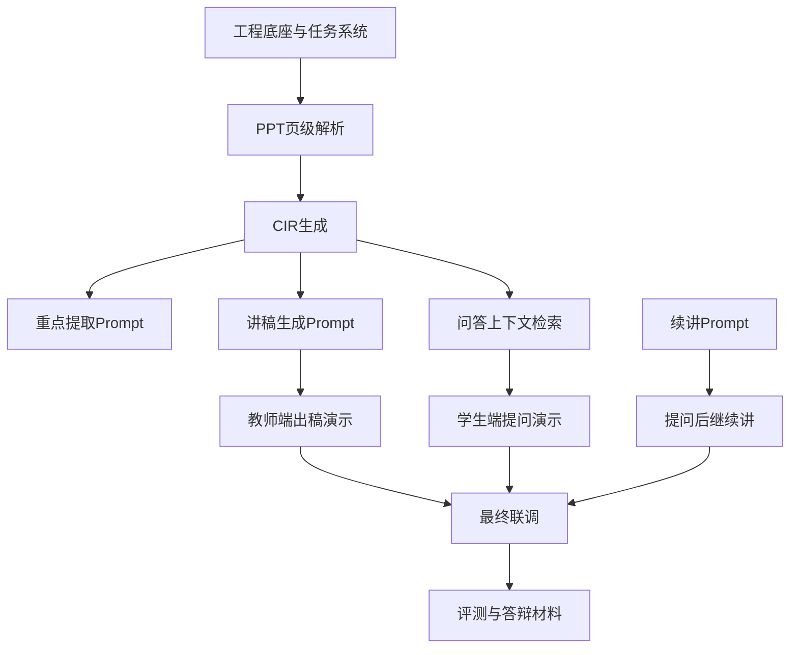

# AI互动智课项目开发任务拆解与团队分工计划（LLM中心版）

## 1. 计划定位

本文档用于把《项目正式架构方案（LLM中心版）》进一步压缩为团队可执行的开发计划。  
适用前提：**4 人团队，5 周周期，目标是做出可演示、可答辩、以 LLM 为核心能力的闭环系统。**

本计划与普通 Web 项目不同，核心不是“页面 + 接口”，而是：

- 让 LLM 真正接入主链路；
- 让 LLM 的输出受到课件结构约束；
- 让 LLM 的效果可被验证、调优、演示。

因此，本计划中所有关键分工都会围绕以下四件事展开：

1. **课件结构化**
2. **LLM 编排**
3. **问答与续讲**
4. **评测与演示闭环**

---

## 2. 5 周总目标

```text
Week 1：搭建工程底座与 LLM 最小调用链
Week 2：跑通模块 A（PPT -> CIR -> Script）
Week 3：跑通学生问答链（基于 CIR 的受控问答）
Week 4：跑通续讲链（理解判断 -> 补讲/继续讲）
Week 5：评测、联调、答辩材料与视频演示
```

最终必须交出的不是一堆零散功能，而是一条完整闭环：

```text
教师上传课件
-> 系统解析并用 LLM 生成讲稿
-> 教师可编辑
-> 学生学习并提问
-> 系统基于课件上下文回答
-> 系统根据理解情况继续讲
```

---

## 3. 四人分工总览

建议四人分工方式为：

> **一个人搭底座，一个人做结构化，一个人做 LLM 编排与生成，一个人做学生闭环与评测。**

| 成员 | 主责方向 | 核心关键词 | 最终价值 |
|---|---|---|---|
| 成员 A | 后端底座与任务系统 | 工程、上传、接口、任务、存储 | 让系统能稳定跑起来 |
| 成员 B | 课件解析与 CIR | PPT解析、重点提取前处理、节点结构 | 让 LLM 有可控输入 |
| 成员 C | LLM 编排与生成主链 | Prompt、讲稿生成、问答、续讲 | 让 LLM 真正成为系统核心 |
| 成员 D | 学生端闭环、评测与联调 | 学习链路、展示、评测、答辩演示 | 让系统能演示、能证明效果 |

---

## 4. 成员职责详细拆解

### 4.1 成员 A：后端底座与任务系统

**定位**：整个项目的基础设施负责人。

负责内容：

- 初始化后端工程
- 配置管理、日志、异常处理、统一响应格式
- 平台免登与基础鉴权
- 文件上传与存储
- 异步任务创建与状态查询
- 基础数据模型
- 对外 API 统一入口

本成员不直接负责“模型效果”，但负责让模型能力能够被稳定调度。

交付物：

| 类型 | 交付项 |
|---|---|
| 工程 | 后端项目骨架、目录结构、配置文件 |
| 接口 | `auth/verify`、`files/upload`、`lesson/parse` 基础壳 |
| 数据 | Courseware、ParseTask、LearningProgress 等基础模型 |
| 运行 | 任务状态查询、错误码、统一响应 |

### 4.2 成员 B：课件解析与 CIR 构建

**定位**：LLM 的“输入质量负责人”。

负责内容：

- PPT 页面抽取
- 标题、列表、正文、图表说明提取
- 页面标准化结构定义
- 页级重点候选整理
- CIR 字段定义
- LessonNode 组织
- 页码、节点、证据片段映射关系

注意：成员 B 不直接负责最终文案风格，而是负责把课件整理成 **足够稳定的结构化上下文**。

交付物：

| 类型 | 交付项 |
|---|---|
| 解析 | SlideParser、PageNormalizer |
| 数据 | CIR、LessonNode、EvidenceFragment 定义 |
| 结果 | 每页结构、节点树、证据片段 |
| 联调 | 为成员 C 提供稳定的 Prompt 输入上下文 |

### 4.3 成员 C：LLM 编排与智能主链

**定位**：整个系统的智能核心负责人。

负责内容：

- 模型接入
- Prompt 模板设计
- 重点提取 Prompt
- 节点组织 Prompt
- 讲稿生成 Prompt
- 问答 Prompt
- 续讲/补讲 Prompt
- 输出 JSON 结构约束
- 幻觉控制、结果校验、缓存策略

这个角色必须确保：

- LLM 输出可控；
- 输出引用课件证据；
- 不同任务使用不同 Prompt；
- 问答和续讲能稳定回到 CIR 上下文。

交付物：

| 类型 | 交付项 |
|---|---|
| 模型 | 模型调用封装、模型路由策略 |
| Prompt | `keypoint_extraction`、`script_generation`、`qa_grounded_answering`、`resume_or_reinforce` |
| 服务 | ScriptGenerator、QAService、ResumeService |
| 控制 | OutputParser、Guardrails、CacheManager |

### 4.4 成员 D：学生闭环、评测与演示整合

**定位**：让系统“能被看见、能被验证”的负责人。

负责内容：

- 学生学习页面或最小交互壳
- 当前节点/页码展示
- 提问入口与答案展示
- 续讲按钮或自动续讲展示
- 学习进度记录联调
- 评测样本组织
- 演示脚本与视频演示组织

这个角色不只是做前端，还负责把系统打造成一个能答辩的产品闭环。

交付物：

| 类型 | 交付项 |
|---|---|
| 页面 | 学习页、提问入口、继续学习入口 |
| 联调 | `播放 -> 提问 -> 回答 -> 续讲` 闭环展示 |
| 评测 | 问答样本、脚本样本、效果记录 |
| 演示 | 演示脚本、Demo 流程、视频录制脚本 |

---

## 5. 每周排期

### Week 1：底座 + LLM 最小链路

本周目标：不是做完整功能，而是先验证“项目能调模型、能传上下文、能稳定返回结构化结果”。

| 成员 | 本周任务 | 本周验收 |
|---|---|---|
| A | 工程初始化、上传接口、任务模型、统一响应 | 能上传课件并创建任务 |
| B | 选定 PPT 解析方式，跑通页级抽取 | 至少 1 份 PPT 可输出页级结构 |
| C | 接入首个 LLM 调用，产出结构化 JSON Demo | 模型可返回受控 JSON |
| D | 设计学生端最小演示流与测试记录模板 | 有演示路径草图与评测模板 |

**周结果要求**：必须证明 LLM 能被正式接入主链路，而不是停留在概念层。

### Week 2：模块 A 闭环

本周目标：完成 `PPT -> CIR -> Script`。

| 成员 | 本周任务 | 本周验收 |
|---|---|---|
| A | parse 接口、结果存储、脚本接口基础壳 | parseId 可查询结构化结果 |
| B | 页面结构标准化、CIR 生成、节点映射 | 至少 3 份 PPT 输出 CIR |
| C | 重点提取 Prompt、节点组织 Prompt、讲稿生成 Prompt | 至少 3 份 PPT 能生成讲稿 |
| D | 教师端演示链路整理与问题记录 | 可演示“上传到出稿” |

**周结果要求**：模块 A 必须成为真正的 LLM 驱动链路，而不是规则拼接稿。

### Week 3：学生问答链路

本周目标：让学生端能对当前学习内容提问，且答案受课件约束。

| 成员 | 本周任务 | 本周验收 |
|---|---|---|
| A | 学习会话、lesson 装配、进度记录接口 | 能加载 lesson 与进度 |
| B | 问答检索上下文、节点证据片段组织 | 问答可拿到 evidence 片段 |
| C | 问答 Prompt、来源页码返回、理解程度判断 | 答案带 evidencePages |
| D | 学生端提问 UI、答案展示、评测样本收集 | 可完成一次提问与回显 |

**周结果要求**：回答必须“基于课件”，而不是普通聊天。

### Week 4：续讲链路与 LLM 效果优化

本周目标：让系统具备“问后继续讲”的教学连续性。

| 成员 | 本周任务 | 本周验收 |
|---|---|---|
| A | 稳定任务链路、补齐缺失接口、修复联调问题 | 核心接口稳定可复现 |
| B | 优化节点依赖、补讲可引用的前置证据 | 有 fallback 节点依据 |
| C | 续讲 Prompt、补讲生成、Guardrails、缓存优化 | 能输出 continue/reinforce/fallback |
| D | 演示“提问后继续讲”、记录效果问题 | 学生闭环可完整演示 |

**周结果要求**：系统要体现“教学连续性”，这是答辩差异化重点。

### Week 5：评测、答辩材料、最终联调

本周目标：证明这套系统不仅能跑，还能展示“LLM 带来的价值”。

| 成员 | 本周任务 | 本周验收 |
|---|---|---|
| A | 整理接口文档、部署说明、系统稳定性修复 | 文档可交付 |
| B | 整理解析样本、结构化样本、节点结果案例 | 有解析对比展示 |
| C | 整理 Prompt 设计、生成案例、问答与续讲案例 | 有 LLM 价值展示材料 |
| D | 总测试、答辩 Demo、录制视频、PPT 素材整合 | 可完成正式演示 |

**周结果要求**：要能讲清楚“为什么必须用 LLM、LLM 具体发挥了什么作用、如何保证不胡说”。

---

## 6. 关键依赖关系



依赖关系的核心结论：

- **A 不完成，整个系统跑不起来；**
- **B 不完成，LLM 没有稳定上下文；**
- **C 不完成，项目就不叫 LLM 系统；**
- **D 不完成，团队拿不出可演示闭环。**

---

## 7. 里程碑与验收标准

### 里程碑 1（第 2 周末）

通过标准：

- 教师可上传 PPT
- 系统可输出 CIR
- 系统可用 LLM 生成讲稿
- 教师可查看讲稿

### 里程碑 2（第 3 周末）

通过标准：

- 学生可进入学习页
- 学生可基于当前节点提问
- 系统返回答案与来源页码
- 理解程度可被输出

### 里程碑 3（第 4 周末）

通过标准：

- 学生提问后可继续学习
- 系统能输出 continue / reinforce / fallback 之一
- 可演示“问后继续讲”

### 最终验收（第 5 周末）

通过标准：

- 教师端完整链路可演示
- 学生端完整链路可演示
- LLM 的作用可以被清晰说明
- 有样本、有结果、有答辩材料

---

## 8. 风险与应对

| 风险 | 影响 | 应对策略 |
|---|---|---|
| 模型输出不稳定 | 讲稿/问答质量波动 | 采用结构化输出 + Guardrails |
| 没有证据约束 | 问答容易胡说 | 强制返回页码和节点来源 |
| CIR 设计频繁变动 | Prompt 与联调反复返工 | 第 2 周前冻结首版 CIR 字段 |
| Prompt 过于泛化 | 效果不稳定 | 一个任务一套 Prompt，不混用 |
| 团队只做业务壳，不做效果验证 | 答辩时说不清 LLM 价值 | Week 5 强制产出评测案例和展示材料 |
| 把 LLM 当附属能力 | 整体架构失焦 | 所有核心链路必须经过 LLM 编排层 |

---

## 9. 每个人最终必须交出的内容

### 成员 A
- 可运行后端底座
- 文件上传与任务系统
- 基础 API
- 接口与部署说明

### 成员 B
- 页级解析结果
- CIR / LessonNode 结构
- 证据片段组织结果
- 结构化样本展示

### 成员 C
- 模型接入封装
- Prompt 集合
- 讲稿生成样本
- 问答与续讲样本
- Guardrails 与输出控制逻辑

### 成员 D
- 学习与提问展示页
- 演示闭环
- 评测记录
- PPT/视频演示素材

---

## 10. 执行原则

本项目的执行优先级必须固定为：

```text
先把 LLM 接进主链路
再把模块 A 做成稳定输入输出
再做受控问答
再做续讲
最后做评测、答辩和展示
```

如果偏离这个顺序，项目很容易退化成“一个普通系统外加一点模型接口”；  
只有坚持这个顺序，最终成果才会真正体现：

> **这是一个围绕 LLM 构建的互动智课系统，而不是一个附带 AI 功能的教学平台。**
