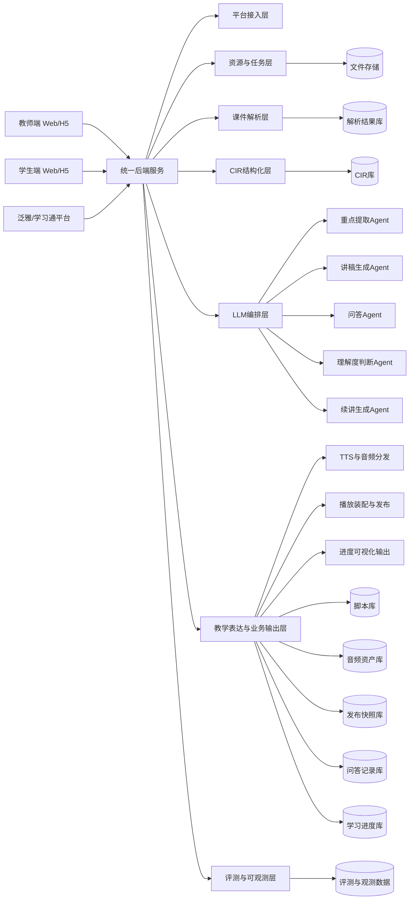
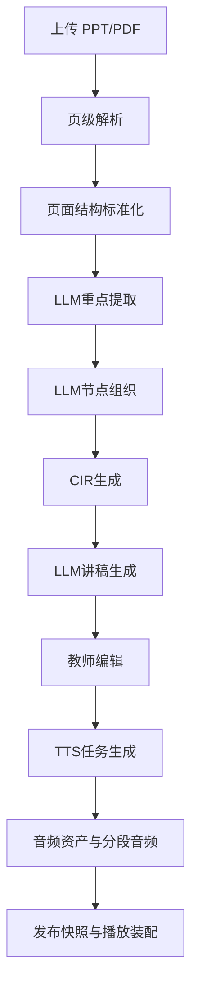

# AI互动智课生成与实时问答系统正式架构方案（LLM中心版）

## 1. 文档定位

本文档用于定义“基于泛雅平台的 AI 互动智课生成与实时问答系统”的正式总体架构。  
本版方案采用 **LLM 中心架构**：系统的核心不是普通业务服务，而是 **以大语言模型（LLM）为推理与生成引擎，以课件结构化中间层为约束骨架** 的教学智能系统。

项目的目标不是“做一个能读 PPT 的程序”，而是做一个能够：

- 理解课件内容；
- 重构教学逻辑；
- 生成可编辑讲稿；
- 在学习过程中回答问题；
- 在提问后继续讲授；
- 全程保持来源可追溯、上下文不断裂。

---

## 2. 架构总原则

### 2.1 总体结论

本系统采用：

> **双端接入 + 统一后端 + 结构化课件中间层 + LLM 编排层 + 受控输出机制**

其中：

- **LLM 是核心智能引擎**，负责理解、归纳、生成、问答、续讲；
- **CIR（Course Intermediate Representation）是核心控制骨架**，负责把 LLM 输出约束在课件事实上；
- **后端编排层** 负责模型调用、上下文裁剪、Prompt 模板、结果校验、缓存和可回溯；
- **教师端/学生端** 只是业务入口与结果消费端，不是核心智能所在。

### 2.2 为什么必须以 LLM 为中心

如果不用 LLM 作为主轴，这个系统最终只能做到：

- 文本提取；
- 关键词拼接；
- 模板化朗读；
- 简单 FAQ。

这不足以满足赛题要求。赛题真正要的是：

- 把课件内容转成“像老师讲”的脚本；
- 在学生提问时理解上下文；
- 判断学生是否理解；
- 根据理解情况补讲或续讲。

这四类能力都天然依赖 LLM 的语义理解与生成能力。

---

## 3. 系统总体架构图



---

## 4. 七层架构说明

### 4.1 平台接入层

负责：

- 学习通免登校验
- 用户身份与角色识别
- 课程/用户同步
- 签名校验与权限控制

这一层不承担智能逻辑，只负责把业务入口稳定接入。

### 4.2 资源与任务层

负责：

- PPT/PDF 上传
- 文件元数据保存
- 异步解析任务创建
- 任务状态查询
- 结果缓存与版本记录

这一层保证整个系统可以按“任务制”稳定运行，而不是让前端等待长链路同步处理。

### 4.3 课件解析层

负责对原始 PPT/PDF 做基础结构化处理：

- 页级文本抽取
- 标题/列表/表格/图片说明抽取
- 页码定位
- 原始页面结构保存

这层只做“把素材变成可供 LLM 消费的结构输入”，不直接承担最终教学表达。

### 4.4 CIR 结构化层

这是全系统的事实骨架。

负责：

- 把页面结果重组为课程结构
- 识别章节、子主题、讲课节点
- 建立页码与节点映射
- 建立节点顺序、前后依赖、重点关系

LLM 后续所有任务都以 CIR 为主要上下文输入，而不是直接读取原始课件。

### 4.5 LLM 编排层

这是本系统的中枢层，也是本版方案的核心变化。

负责：

- Prompt 模板管理
- 模型选择与路由
- 上下文裁剪与节点检索
- Few-shot 示例装配
- 输出结构约束
- 幻觉控制与结果校验
- 缓存策略与重试策略

它不是单个“调一次模型 API”，而是一层明确的智能编排能力。

### 4.6 教学表达与业务输出层

负责把 LLM 的结果变成前后端可消费的稳定对象：

- 讲稿
- 问答结果
- 补讲结果
- 续讲建议
- TTS 输入文本
- 音频资产与分段音频
- LessonPackage/发布快照
- 学习进度与进度可视化输出

这一层不再停留在“文本生成结果”，而是承担 **脚本到语音、语音到播放、播放到学习状态** 的正式交付职责。

### 4.7 评测与可观测层

这是贯穿全链路的横切能力层，负责：

- Prompt、检索、模型输出的链路追踪
- token/成本/时延监控
- groundedness、relevance、completeness 等质量评测
- 解析成功率、TTS 成功率、播放成功率、问答响应率统计
- 样本回放、版本对比、上线门禁

这一层必须被正式写入架构，而不是作为实现阶段的附带测试工作。

---

## 5. LLM 在系统中的角色分配

### 5.1 LLM 不只是“生成文案”

在本项目中，LLM 同时承担五种职责：

| 角色 | 作用 | 典型输入 | 典型输出 |
|---|---|---|---|
| 语义理解器 | 理解页面内容和教学重点 | 页级文本、标题、图表说明 | 页面重点、主题摘要 |
| 结构重构器 | 把页面整理成讲课节点 | 多页内容、章节关系 | 节点树、前后依赖 |
| 教学表达器 | 生成老师口吻讲稿 | CIR节点、教学风格 | 开场白、过渡语、节点讲稿 |
| 问答推理器 | 回答学生提问 | 当前节点、问题、上下文 | 带来源的答案 |
| 续讲决策器 | 判断如何继续讲 | 提问记录、理解程度、当前节点 | 继续讲/补讲/回退建议 |

### 5.2 LLM 与规则系统的关系

正确关系不是“全靠 LLM”，而是：

- **LLM 负责理解与生成**；
- **规则系统负责边界与约束**。

规则系统必须控制：

- 可使用哪些页码与节点作为证据；
- 输出 JSON 结构；
- 讲稿长度上限；
- 问答必须返回来源页码；
- 续讲只允许在当前节点、前置节点、补讲节点之间选择。

---

## 6. 核心中间表示：CIR

### 6.1 定位

CIR（Course Intermediate Representation）是 **LLM 系统的结构化上下文层**。  
它的存在是为了防止模型直接对原始课件自由发挥。

### 6.2 层级结构

```text
Course
└── Chapter
    └── LessonNode
        ├── PageRefs
        ├── KeyPoints
        ├── Summary
        ├── ScriptDraft
        ├── EvidenceFragments
        └── Prev/Next/Prerequisites
```

### 6.3 CIR 示例

```json
{
  "courseId": "course-001",
  "coursewareId": "cw-001",
  "title": "高等数学-极限基础",
  "chapters": [
    {
      "chapterId": "ch-01",
      "chapterName": "函数极限的基本概念",
      "nodes": [
        {
          "nodeId": "node-01",
          "pages": [1, 2],
          "title": "极限的课程导入",
          "keyPoints": [
            "极限用于描述变化趋势",
            "本节关注函数趋近过程",
            "先理解直观意义，再进入定义"
          ],
          "summary": "这是课程导入节点，用于建立极限概念的学习语境。",
          "evidenceFragments": [
            "页1标题：函数极限",
            "页2小结：关注x趋近某点时函数值变化"
          ],
          "scriptDraft": "同学们，这一部分我们先不急着上定义，而是先抓住极限到底在研究什么……",
          "nextNodeId": "node-02"
        }
      ]
    }
  ]
}
```

### 6.4 CIR 架构约束

为保证知识点召回的精确性、证据保真性和教师可审核性，CIR 必须遵守以下约束：

1. **原文证据层不可改写**  
   PPT/PDF 页面中的原始标题、正文、术语、公式、图表说明应被视为证据层内容，不允许在 CIR 提取阶段被覆盖式改写。

2. **只做结构化补充，不做原文替换**  
   CIR 可以新增节点、重点、摘要、依赖关系、证据片段等结构化字段，但这些字段不能冒充或替代原页原文。

3. **CIR 至少分三层表达**  
   - 原文证据层：保存页级原文与页码锚点  
   - 结构标注层：保存 chapter / node / keyPoint / dependency  
   - 机器补充层：保存 summary / scriptDraft / supplementNote

4. **所有下游结果必须可回链到原页**  
   无论是讲稿、问答、补讲还是续讲建议，都必须能回指到原始 page 或 evidence fragment，而不是只回指到模型改写后的文本。

5. **例外必须可逆且可审计**  
   仅允许对乱码修复、明显 OCR 错误修正、合规脱敏等做机器修正，但必须保留原始值与修正值边界，不能直接覆盖原文证据。

### 6.5 知识点精确召回技术路线

本项目的知识点召回不应只依赖向量检索，而应采用 **“结构约束 + 词项精确匹配 + 语义召回 + 重排回链”** 的混合路线。

```text
Query
-> 术语归一化/别名扩展
-> page/node 双粒度候选召回
-> 关键词/BM25 精确匹配
-> 向量语义召回
-> 重排（页码/节点/证据片段）
-> evidence 回链
-> 输出给 QA / Resume / Script
```

建议采用以下组合策略：

- **页级 + 节点级双索引**：同时保留 page 粒度和 LessonNode 粒度，避免只靠大段语义块丢失原始表述。
- **关键词/BM25 精确召回优先**：对课程术语、公式名、专有表达、教师强调语句，优先依赖词项匹配与倒排索引。
- **术语字典/别名归一化**：把课程术语、缩写、同义表达映射到统一检索入口，但不改动原文存储。
- **向量召回作为补充**：用于补足同义问法、语义改写问法和跨页关联，不作为唯一证据来源。
- **重排与证据回链**：最终候选必须按页码、节点、术语命中度、证据片段密度进行重排，并输出 evidence fragment。
- **教师可审的知识锚点**：每个 keyPoint 应尽量绑定 page、node、原文片段三元组，而不是只保留抽象摘要。

### 6.6 CIR 与知识锚点

从架构上看，CIR 中的知识点不应只是一个字符串标签，而应是一个可回溯的知识锚点（Knowledge Anchor）：

```text
KnowledgeAnchor
= keyPointLabel
+ pageRef
+ nodeRef
+ sourceSpan
+ aliases(optional)
+ confidence(optional)
```

这样设计的目的，是保证：

- 召回时能精确回到原页原句；
- 问答时能附带证据片段；
- 教师审核时能判断“这是课件原意，还是机器补充”；
- 续讲时能基于原节点而不是抽象摘要恢复上下文。

---

## 7. 模块 A：智课生成架构

### 7.1 模块 A 的本质

模块 A 不是“把 PPT 转成文字”，而是：

> **把课件转成适合 LLM 教学表达的结构化课程表示，并基于该表示生成可编辑讲稿。**

### 7.2 模块 A 内部流水线



### 7.3 模块 A 内部子能力

| 子能力 | 是否依赖 LLM | 说明 |
|---|---|---|
| 页面解析 | 否 | 负责基础结构抽取 |
| 重点提取 | 是 | 从页级内容中提取可讲重点 |
| 节点组织 | 是 | 把页面组织成教学节点 |
| CIR生成 | 半依赖 | 结构框架由规则控制，内容由 LLM 补足 |
| 讲稿生成 | 是 | 按节点生成老师口吻讲稿 |
| 脚本编辑保存 | 否 | 负责版本化保存 |
| TTS音频生成 | 否（调用语音服务） | 把节点级讲稿转成可播放音频 |
| 播放装配与发布 | 否 | 把脚本、音频、节点顺序组装成可学习智课 |

### 7.4 模块 A 产物

模块 A 输出至少应包括：

- `parseId`
- `CourseStructure/CIR`
- `LessonNode` 列表
- `ScriptDraft`
- 教师编辑后的 `ScriptVersion`
- `AudioAsset/SectionAudio`
- `PublishedLessonSnapshot/LessonPackage`

### 7.5 模块 A 的正式输出表达链

模块 A 的最终目标不是停在文本脚本，而是形成一个 **可被教师审核、可被 TTS 消费、可被学生播放** 的智课输出链：

```text
课件 -> CIR -> ScriptVersion -> SectionAudio -> LessonPackage -> Student Player
```

其中：

- `ScriptVersion` 代表教师可编辑的正式脚本版本；
- `SectionAudio` 代表节点级或段级语音资源；
- `LessonPackage` 代表学生端实际消费的发布快照；
- 数字人展示层当前不展开，但应被视为 `LessonPackage + SectionAudio` 之上的可选表现层。

---

## 8. 模块 B：实时问答架构

### 8.1 模块 B 的本质

模块 B 不是通用聊天，而是：

> **基于当前学习节点和课件证据的受控问答。**

### 8.2 问答输入

- 当前 `lessonId`
- 当前 `nodeId`
- 当前页码
- 学生问题（文字或语音转写结果）
- 最近若干条问答历史
- 对应 CIR 片段
- 对应证据片段
- 当前 `qaSessionId`

### 8.3 问答输出

- `answer`
- `evidencePages`
- `evidenceNodeIds`
- `understandingLevel`
- `followUpSuggestion`
- `answerAudioRef`（可选，供语音播报）

### 8.4 语音问答主流程

语音问答不是一个孤立的 ASR 接口，而是一条完整链路：

```text
语音输入 -> 语音转文字 -> 受控问答 -> 证据返回 -> 理解度判断 -> 可选答案语音播报
```

因此，模块 B 必须同时管理：

- 文本问答入口
- 语音问答入口
- 多轮会话上下文
- 答案的文本与语音双输出

### 8.5 LLM 问答控制策略

问答环节必须受以下规则约束：

1. 不允许脱离当前节点及其相邻节点胡乱扩展；
2. 答案必须返回页码或节点证据；
3. 对课件未覆盖的问题应保守回答；
4. 问答结果应同时输出“理解程度判断”。

---

## 9. 模块 C：续讲与节奏调整架构

### 9.1 模块 C 的本质

模块 C 是 LLM 驱动的教学续航层，用于解决“问完之后怎么继续讲”的问题。

### 9.2 决策逻辑

模块 C 根据：

- 当前节点
- 问答记录
- 理解程度
- 节点先后关系
- 前置依赖关系

输出三类动作之一：

| 动作 | 含义 |
|---|---|
| continue | 回到原节点继续讲 |
| reinforce | 插入一小段补讲 |
| fallback | 回退到前置节点重讲 |

### 9.3 LLM 在模块 C 中的作用

LLM 不是随便生成一段话，而是：

- 判断学生是否真正理解；
- 生成一段与当前节点强相关的补讲内容；
- 给出续讲建议；
- 保持与原脚本语气一致。

### 9.4 进度可视化输出

模块 C 不只输出“内部状态”，还要向学生端提供可视化所需对象：

- 当前学习节点
- 当前页码
- 当前进度百分比
- 最近一次问答打断点
- 补讲插入路径
- 下一节点建议

因此，进度可视化不是纯前端装饰，而是架构中的正式输出能力。

---

## 10. LLM 编排层详细设计

### 10.1 编排层输入输出

```text
输入：
- 用户任务类型（提取/生成/问答/续讲）
- 目标节点或页码
- 结构化上下文（CIR）
- 证据片段
- Prompt模板

输出：
- 受控 JSON
- 业务对象（Script/QA/ResumePlan）
- 置信度或校验状态
```

### 10.2 编排层子模块

| 子模块 | 作用 |
|---|---|
| PromptTemplateManager | 管理不同任务模板 |
| ContextBuilder | 拼接页级内容、节点内容、证据片段 |
| ModelRouter | 不同任务选择不同模型或参数 |
| OutputParser | 把模型输出解析成 JSON |
| Guardrails | 校验页码、字段、长度、格式 |
| CacheManager | 对重复请求做缓存 |
| EvalRecorder | 记录评测样本与效果 |
| SessionStateManager | 维护问答会话与学习运行态 |

### 10.3 推荐 Prompt 分类

至少分为五套：

1. `keypoint_extraction`
2. `lesson_node_building`
3. `script_generation`
4. `qa_grounded_answering`
5. `resume_or_reinforce`
6. `tts_ready_script_rendering`

### 10.4 发布态与运行态

为了避免“生成完成但播放与续讲仍然松散拼接”，系统必须显式区分：

- **发布态**：教师确认后可对学生发布的正式智课快照；
- **运行态**：学生学习中的实时会话状态。

发布态建议使用 `PublishedLessonSnapshot/LessonPackage` 建模，绑定：

- CIR 版本
- ScriptVersion
- AudioAsset/SectionAudio
- 播放顺序与节点映射

运行态建议使用 `LearningSession` 建模，绑定：

- 当前节点
- 当前页码
- 当前问答会话
- 当前播放片段
- 当前学习进度

---

## 11. 接口规划（LLM中心版）

| 接口 | 说明 |
|---|---|
| `POST /api/v1/auth/verify` | 平台免登校验 |
| `POST /api/v1/files/upload` | 上传 PPT/PDF |
| `POST /api/v1/lesson/parse` | 创建解析与结构化任务 |
| `GET /api/v1/lesson/parse/{parseId}` | 查询结构化结果 |
| `POST /api/v1/lesson/generateScript` | 调用讲稿生成链路 |
| `POST /api/v1/lesson/generateAudio` | 生成整课或分段音频 |
| `GET /api/v1/scripts/{scriptId}` | 获取脚本详情 |
| `PUT /api/v1/scripts/{scriptId}` | 保存教师编辑脚本 |
| `POST /api/v1/lesson/publish` | 生成正式发布快照 |
| `POST /api/v1/lesson/play` | 学生学习装配接口 |
| `POST /api/v1/qa/interact` | 基于上下文的问答 |
| `POST /api/v1/qa/voiceToText` | 语音转文字 |
| `GET /api/v1/qa/session/{sessionId}` | 查询多轮问答会话 |
| `POST /api/v1/progress/track` | 学习进度记录 |
| `POST /api/v1/progress/adjust` | 获取续讲/补讲建议 |

### 11.2 接口覆盖与异步集成说明

当前接口设计已覆盖赛题要求中的关键接口类型，并且总量不少于 10 个。  
其中以下链路必须采用异步任务模式：

- 课件解析
- 讲稿批量生成（可选异步）
- 音频合成
- 发布装配

### 11.3 统一响应与签名机制

所有对外接口建议统一返回：

```json
{
  "code": 200,
  "msg": "success",
  "data": {},
  "requestId": "req-20260326-001"
}
```

同时保留全局签名字段 `enc` 与时间戳参与签名校验，用于适配平台集成与链路排障。

---

## 12. 关键数据对象

| 数据对象 | 说明 | 关键字段 |
|---|---|---|
| Courseware | 原始课件 | coursewareId, fileType, filePath, pageCount |
| ParseTask | 解析任务 | parseId, status, progress, errorMessage |
| CIR | 课程中间表示 | structureId, chapters, nodes, evidence |
| LessonNode | 讲课节点 | nodeId, pages, keyPoints, summary, nextNodeId |
| Script | 讲稿主对象 | scriptId, structureId, version, style |
| ScriptSection | 节点级讲稿 | sectionId, nodeId, content, duration, relatedPage |
| VoiceProfile | 音色与讲授风格 | voiceId, voiceStyle, speechRate, emotionTone |
| AudioAsset | 音频资源 | audioId, scriptId, nodeId, voiceId, url, duration, status |
| SectionAudio | 分段音频映射 | sectionAudioId, sectionId, audioId, order |
| KnowledgeAnchor | 知识点锚点 | anchorId, keyPointLabel, pageRef, nodeRef, sourceSpan |
| PublishedLessonSnapshot | 正式发布快照 | publishId, structureVersion, scriptVersion, audioVersion, status |
| LessonPackage | 学生播放包 | lessonId, nodeSequence, scriptRefs, audioRefs, subtitleRefs |
| QASession | 多轮问答会话 | sessionId, lessonId, currentNodeId, historyCount |
| QARecord | 问答记录 | qaId, nodeId, question, answer, evidencePages |
| LearningSession | 学习运行态 | sessionId, lessonId, currentNodeId, currentAudioId, qaSessionId |
| ResumePlan | 续讲结果 | action, targetNodeId, supplementText |
| LearningProgress | 学习进度 | progressId, lessonId, currentNodeId, currentPage |
| TaskLog | 任务与调用日志 | taskId, taskType, status, durationMs, requestId |

---

## 13. 技术实现建议

### 13.1 后端技术建议

建议采用 Python 技术路线，原因不是“行业习惯”，而是本项目强依赖：

- 解析库生态；
- LLM SDK 生态；
- Prompt/检索/评测工具链；
- 快速编排能力。

建议分层：

| 层级 | 建议方案 |
|---|---|
| API 层 | FastAPI |
| 任务层 | 后台任务机制 / 队列 |
| 存储层 | 对象存储 + 关系型数据库 |
| LLM层 | 多模型 SDK 接入 + Prompt 编排 |
| 语音层 | TTS 服务接入 + 音频缓存/分发 |
| 检索层 | 基于 CIR 节点和页码的混合检索（BM25/术语字典/向量召回/重排） |
| 评测层 | 样本集、问答回放、结果评分 |

### 13.2 LLM 工程化要点

必须显式考虑：

- 输出结构化 JSON
- 证据约束
- Prompt 版本管理
- 回答缓存
- 失败重试
- 幻觉控制
- 评测闭环

### 13.3 平台嵌入与兼容要求

系统必须支持：

- 泛雅 Web 端嵌入
- 学习通移动端 WebView/H5 形态嵌入
- 统一登录、Token 透传、异步接口调用集成

在架构层面，应把“嵌入式运行”视为正式约束，而不是部署时临时适配。

### 13.4 性能、样本与容量约束

系统设计必须对齐以下指标：

- 课件解析响应时间 ≤ 2 分钟 / 份
- 问答响应时间 ≤ 5 秒
- 知识点识别准确率 ≥ 80%
- 答案准确率 ≥ 85%
- 课件解析样本集不少于 100 份，覆盖文 / 理 / 工
- 功能接口数量不少于 10 个
- 支持并发访问 ≥ 10 人

这些不是测试阶段才关心的指标，而是会反向约束任务队列、缓存、上下文长度、TTS 批量策略和评测方案的正式架构约束。

### 13.5 弱网与终端资源约束

考虑到平台运行环境包含 Web 端和移动端，系统还应对齐：

- 音频资源可缓存和分段拉取
- 播放链路支持断点恢复
- 页面与播放器保持轻量化
- 弱网场景下支持文本优先、语音降级

---

## 14. 阶段性落地路径

### 第一阶段：LLM驱动的模块 A 闭环

目标：

- 支持 PPT 上传
- 产出页级结构
- 用 LLM 提取重点
- 用 LLM 组织节点
- 生成讲稿初稿
- 教师可编辑
- 生成分段音频并形成基础播放包

### 第二阶段：LLM驱动的问答链路

目标：

- 学生能提问
- LLM 基于 CIR 上下文回答
- 返回来源页码
- 输出理解程度
- 支持文字/语音两种问答入口

### 第三阶段：LLM驱动的续讲链路

目标：

- 根据理解程度自动决定继续讲/补讲/回退
- 生成简短补讲内容
- 更新学习进度并恢复讲解
- 输出进度可视化数据

---

## 15. 架构约束

### 必须坚持

1. **LLM 是中枢，不是外挂。**
2. **CIR 是事实骨架，不允许模型脱离结构自由发挥。**
3. **问答必须返回证据页码或节点。**
4. **续讲必须可解释。**
5. **脚本必须允许教师编辑。**
6. **语音输出是正式能力，不是文档末尾附带功能。**
7. **发布态与运行态必须分离建模。**
8. **进度可视化、平台嵌入、性能指标必须进入正式架构约束。**
9. **CIR 提取阶段不得改写原页知识点表述，只允许做结构化补充与可审计修正。**
10. **知识点召回必须优先回源原页证据，向量语义召回只能作为补充而非替代。**

### 明确避免

- 把系统做成“上传课件 + 调一次模型 + 出一段长文”
- 让问答完全不受课件约束
- 在没有结构化中间层的情况下直接生成整课内容
- 没有 Prompt 管理、没有结果校验、没有效果评测
- 只有文本脚本，没有音频、播放与发布闭环
- 只有进度记录，没有进度可视化与运行态
- 在 CIR 提取阶段覆盖式改写课件原文
- 只用向量召回替代原文证据与词项精确匹配

---

## 16. 最终架构摘要

```text
原始课件不是系统终点，而是 LLM 的输入素材
页级解析不是最终能力，而是结构化前处理
CIR 不是附属数据，而是模型上下文骨架
LLM 不是可选增强，而是重点提取、讲稿生成、问答、续讲的核心引擎
后端不是简单 API 集合，而是模型编排、音频交付、发布快照与运行会话的统一控制中心
```

本方案的最终定义是：  
**一个以 LLM 为核心推理引擎、以 CIR 为约束骨架、以 TTS/播放/发布能力完成正式交付、以教师端和学生端为消费入口的互动智课系统。**
