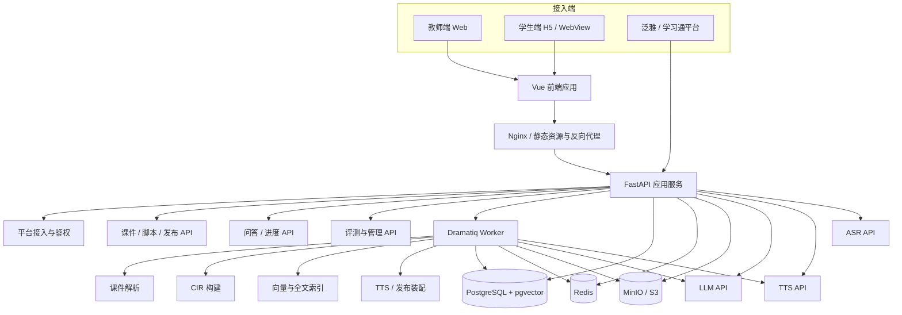
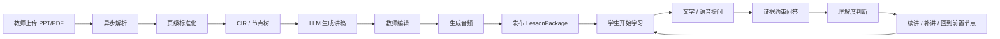
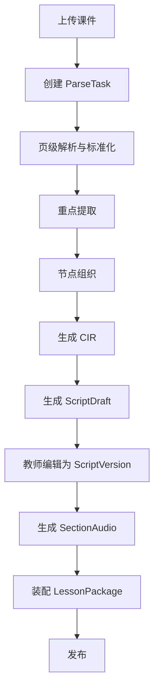
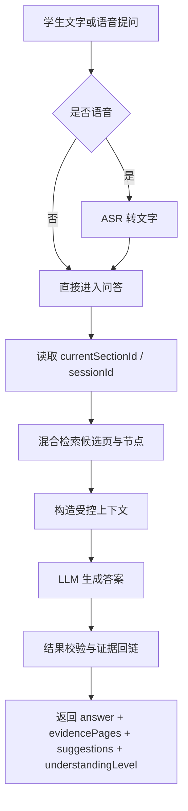

# AI互动智课生成与实时问答系统正式架构方案（定稿版）

> 定位：正式架构基线文档  
> 定稿顺序：先确定项目正式架构方案，再进行技术栈选择  
> 团队现状：Vue + Python

---

## 1. 文档定位与定稿结论

本文档用于对“基于泛雅平台的 AI 互动智课生成与实时问答系统”进行正式架构定稿。定稿后的项目基线是：

> **采用“CIR / KnowledgeAnchor 约束的 LLM 中心模块化单体架构”，以前后端分离的 Vue 双视图接入为表现层，以统一 Python 后端为业务中枢，以异步任务链支撑课件解析、索引构建、语音合成和发布装配，形成“课件解析 -> 智课生成 -> 实时问答 -> 进度续接”的完整闭环。**

这里的“模块化单体”不是简陋单体，而是：

- 部署形态上保持 **一个后端主服务 + 一个异步 Worker**，降低比赛周期内的工程复杂度；
- 代码组织上坚持 **按领域拆模块**，保证后续可演进；
- 智能能力上坚持 **LLM 为中枢、CIR 为约束、证据回链为硬规则**；
- 交付形态上坚持 **发布态 / 运行态分离**，避免“生成完成”和“学生实际学习”混在一起。

本定稿版保留了已有文档中合理的内容，例如：LLM 中心架构、CIR、KnowledgeAnchor、混合检索、发布态/运行态分离、模块化单体与异步任务机制；同时完成以下关键修正：

- 前端由 React 改为 **Vue 3 技术路线**，与当前团队技术栈一致；
- 明确补入 **ASR（语音转文字）**，支撑语音提问；
- 明确补入 **平台接入与签名校验层**，对齐开放 API 规范；
- 将“**答案必须返回来源页码/证据片段**”写入正式架构硬约束；
- 将“**异步解析、脚本编辑、发布装配、学习运行态**”纳入正式主链路，而不是后补功能。

---

## 2. 架构目标与正式约束

### 2.1 系统目标

本项目不是“聊天机器人 + PPT 播放器”，而是面向泛雅 Web 端与学习通移动端场景的智能学习闭环系统。正式目标是：

1. 教师上传 PPT / PDF 后，系统能在限定时间内完成解析与结构化；
2. 系统基于课程结构生成可编辑讲稿，并支持语音化与发布；
3. 学生学习过程中可以用文字或语音打断提问；
4. 问答必须尽可能回到课件原页与原证据，不做无依据的自由发挥；
5. 提问结束后，系统能根据理解程度继续讲、补讲或回到前置知识点；
6. 全链路具备可观测、可评测、可答辩的证据输出。

### 2.2 正式约束清单

| 约束项 | 架构响应 |
|---|---|
| 泛雅 Web / 学习通移动端可嵌入运行 | 前端采用 H5 / WebView 友好的 Vue 方案，后端保留平台同步、Token 透传、签名校验能力 |
| 课件解析需异步化 | `lesson/parse` 采用任务制，提交返回 `parseId`，并提供状态/结果查询接口 |
| 功能接口不少于 10 个 | 统一规划 `/api/v1` 接口族，覆盖上传解析、脚本、音频、问答、进度、平台同步 |
| 问答响应时间不超过 5 秒 | 采用当前节点限定、混合检索、缓存、上下文裁剪与轻量回答策略 |
| 课件解析不超过 2 分钟 / 份 | 使用服务端异步解析、页级标准化、索引后台构建 |
| 知识点识别率 / 答案准确率可评估 | 将黄金样本、评测脚本、日志与回放纳入正式架构 |
| 回答需带来源页码 / 证据 | 引入 `KnowledgeAnchor`、`evidencePages`、`evidenceSpans` 作为正式输出字段 |
| 问后能继续讲 | 显式设计 `ResumePlan`、`LearningSession` 与 `progress/adjust` 链路 |

### 2.3 为什么选“LLM 中心 + CIR 约束 + 模块化单体”

#### 1）为什么不是纯规则系统

纯规则系统最多能做到标题提取、关键词拼接、模板朗读与 FAQ，对“像老师一样讲”“基于上下文回答”“根据理解情况补讲”支撑不足。

#### 2）为什么不是重型多 Agent 或微服务

比赛阶段的核心风险在于：解析质量、证据问答、续接逻辑、演示闭环，而不在于服务治理。过早引入微服务、复杂 Agent 框架、分布式消息系统，会把时间消耗在非核心问题上。

#### 3）为什么 CIR 必须存在

LLM 负责理解与生成，但不能直接对原始课件自由发挥。CIR 是结构化中间骨架，用来固定：

- 节点边界；
- 页码映射；
- 重点组织；
- 前置依赖；
- 可引用证据；
- 发布态与运行态的关联。

#### 4）为什么要保留模块化单体

你们当前团队使用 Vue 和 Python，最稳妥的落地方式是：

- 一个前端代码仓库，承载教师端与学生端两套路由；
- 一个 Python API 服务，承载核心业务；
- 一个异步 Worker，承载解析、索引、TTS、发布任务；
- 一套 PostgreSQL / Redis / MinIO 作为共享基础设施。

这可以最大化复用团队已有经验，同时保留后续拆分空间。

---

## 3. 系统总体架构

### 3.1 总体架构图


### 3.2 业务闭环图



### 3.3 运行形态定稿

正式运行形态固定为：

一个前端应用：Vue 3 + Vite，内部按教师端 / 学生端分路由与布局；

一个后端主服务：FastAPI，对外提供 /api/v1 统一接口；

一个异步 Worker：处理耗时任务；

三类基础存储：PostgreSQL、Redis、MinIO / S3；

三类外部 AI 能力：LLM、TTS、ASR；

一套评测与监控能力：指标、日志、黄金样本、性能统计。

## 4. 七层分层架构设计

| 层级 | 主要职责 | 核心对象 / 模块 | 正式约束 |
|---|---|---|---|
| 1. 平台接入与安全适配层 | Token 透传、课程/用户同步、签名校验、角色权限 | `syncCourse`、`syncUser`、签名中间件、`RBAC` | 对齐开放 API 规范，所有外部调用可审计 |
| 2. 应用 API 与 BFF 层 | 为教师端、学生端、平台对接方提供统一接口 | `lesson`、`script`、`qa`、`progress`、`platform API` | `/api/v1`、JSON、`requestId`、错误码统一 |
| 3. 异步任务与编排层 | 解析、索引、TTS、发布装配、耗时任务重试 | Worker、任务队列、状态机 | 解析必须任务制，不能阻塞前端 |
| 4. 课件解析与 CIR 层 | 页级抽取、页面标准化、节点组织、证据锚定 | `PageAsset`、`PageBlock`、`CIR`、`LessonNode` | 原文证据不可被覆盖式改写 |
| 5. LLM 编排与检索层 | Prompt 编排、上下文拼装、混合检索、结果校验 | `PromptTemplateManager`、`ContextBuilder`、`KnowledgeAnchor` | 模型输出必须受证据与 JSON 结构约束 |
| 6. 教学交付与运行态层 | 讲稿版本、音频资产、发布快照、学习会话、进度续接 | `ScriptVersion`、`LessonPackage`、`LearningSession`、`ResumePlan` | 发布态与运行态必须分离 |
| 7. 评测与可观测层 | 指标监控、日志追踪、黄金集回归、样本统计 | Prometheus metrics、Sentry、JSONL 黄金集 | 达标证据必须可沉淀、可导出 |

### 4.1 平台接入与安全适配层

这一层负责处理泛雅平台 / 学习通的对接要求，包括：

- 课程同步与用户同步；
- 用户身份与角色识别；
- 鉴权 Token 透传；
- `enc` 签名校验与 `time` 时间戳校验；
- 统一错误码、请求追踪与审计日志。

这一层只负责“让系统能被安全接入”，不直接承担智能逻辑。

### 4.2 应用 API 与 BFF 层

这一层将教师端、学生端和平台调用统一收口，避免前端直接操作复杂数据模型。接口输出要尽量贴近场景：

- 教师端关心解析预览、目录树、脚本编辑、发布状态；
- 学生端关心 lesson 播放、当前节点、提问、来源高亮、续讲计划；
- 平台方关心课程同步、用户同步、回调风格、签名机制。

### 4.3 异步任务与编排层

这一层是比赛能否稳定演示的关键。凡是耗时明显、可排队、允许轮询状态的能力，都应任务化：

- 课件解析；
- 索引构建 / embedding 生成；
- 音频合成；
- `LessonPackage` 发布装配；
- 可选的批量讲稿生成。

### 4.4 课件解析与 CIR 层

这一层不直接生成“老师口吻内容”，而是先做事实层的结构化：

- 把 PPT / PDF 解析成页级块结构；
- 把标题、列表、正文、图表说明、备注等元素做标准化；
- 基于页面边界与主题连贯性组织为 `LessonNode`；
- 为后续问答和续讲建立页码、节点、证据片段的三元绑定。

### 4.5 LLM 编排与检索层

这是正式架构的中枢。LLM 不是作为“外挂接口”单独调用，而是统一纳入编排层：

- 不同任务使用不同 Prompt；
- 当前节点、相邻节点、页级证据片段由 `ContextBuilder` 负责裁剪；
- 检索采用“全文 / 术语精确匹配 + 向量召回 + 重排 + 证据回链”；
- `OutputParser` 与 `Guardrails` 负责输出校验；
- 失败时提供重试、降级与兜底说明。

### 4.6 教学交付与运行态层

这一层负责把智能结果变成真正可消费的业务对象：

- `ScriptVersion`：教师可编辑的正式脚本版本；
- `AudioAsset / SectionAudio`：章节级音频；
- `PublishedLessonSnapshot / LessonPackage`：学生端可播放的正式快照；
- `LearningSession`：学生当前学习会话；
- `ResumePlan`：本次问答后系统决定如何继续讲。

### 4.7 评测与可观测层

这一层不属于“后期补文档”，而是正式架构的一部分。它承载：

- 解析耗时、问答耗时、TTS 成功率；
- 知识点识别准确率、答案准确率；
- 100 份课件样本覆盖情况；
- 请求追踪、异常定位、回归测试与演示证据输出。

## 5. 核心数据模型设计

### 5.1 对象关系总览
```
Courseware
  -> ParseTask
  -> PageAsset / PageBlock
  -> CIR
      -> Chapter
      -> LessonNode
          -> KnowledgeAnchor
          -> ScriptSection
              -> SectionAudio
  -> ScriptVersion
  -> PublishedLessonSnapshot / LessonPackage
  -> LearningSession
      -> QASession / QARecord
      -> ResumePlan
      -> LearningProgress
```
### 5.2 CIR 定义

CIR（Course Intermediate Representation）是本系统最重要的中间表示。它既是“课程结构 JSON”的正式实现，也是后续讲稿、问答与续讲的共同上下文。

#### CIR 必须满足的规则

- 原文证据层不可丢失：原页文本、图表说明、公式说明、标题等必须可回查；
- 结构标注层可扩展：章节、节点、重点、摘要、依赖关系可以增补；
- 机器补充层可审计：机器生成的摘要、候选讲稿、常见问题必须带来源与版本；
- 所有下游结果必须可回链：脚本、问答、补讲都要能回到页码与证据片段；
- 教师可审核：结构与脚本必须能在教师端查看与修订。

#### CIR 示例

```json
{
  "coursewareId": "cw_001",
  "title": "材料力学-梁弯曲理论",
  "chapters": [
    {
      "chapterId": "chap_01",
      "chapterName": "梁弯曲理论基础",
      "nodes": [
        {
          "nodeId": "node_01",
          "nodeName": "平面假设的定义",
          "pageRefs": [3, 4, 5],
          "keyPoints": [
            "平面假设是梁弯曲理论的基本前提",
            "变形前后的截面保持平面",
            "该假设简化了正应力推导"
          ],
          "summary": "本节点用于建立后续公式推导的前置概念。",
          "anchors": [
            {
              "anchorId": "ka_1001",
              "pageRef": 3,
              "sourceSpan": "平面截面变形后仍保持平面",
              "label": "平面假设"
            }
          ],
          "prerequisiteNodeIds": [],
          "nextNodeId": "node_02"
        }
      ]
    }
  ]
}
```

### 5.3 KnowledgeAnchor 设计

KnowledgeAnchor 是支撑“证据问答”的核心对象，正式定义如下：

```
KnowledgeAnchor
= label
+ pageRef
+ nodeRef
+ sourceSpan
+ aliases(optional)
+ confidence(optional)
```

它的作用是：

保证问答时能返回具体页码；

保证续讲时能回到正确节点；

保证教师审核时知道哪部分是课件原意；

保证知识点召回不只依赖抽象 summary。

### 5.4 发布态与运行态对象

| 维度 | 发布态 | 运行态 |
|---|---|---|
| 代表对象 | `PublishedLessonSnapshot`、`LessonPackage` | `LearningSession`、`QASession`、`ResumePlan` |
| 用途 | 给学生端提供稳定内容快照 | 记录学生当前正在学到哪里、问了什么、接下来怎么讲 |
| 变化频率 | 低，教师发布后稳定 | 高，学习过程中实时变化 |
| 是否可编辑 | 教师重新发布时变更 | 不对学生直接暴露底层对象 |
| 是否参与评测 | 参与讲稿、音频、结构评测 | 参与问答时延、续接效果、学习行为评测 |

## 6. 三大核心模块正式设计

### 6.1 模块 A：智课生成

#### 目标

把 PPT / PDF 转成可教、可改、可播、可发布的智课资源。

#### 主流程



#### 模块 A 的正式输出

- `parseId`
- `structurePreview`
- `CIR`
- `ScriptDraft / ScriptVersion`
- `AudioAsset / SectionAudio`
- `PublishedLessonSnapshot / LessonPackage`

#### 设计要点

- 解析阶段先保证页级结构准确，再做智能补充；
- `structurePreview` 应在教师端可视化显示为“目录树 + 每页重点”；
- 脚本生成后必须允许教师修改，不以机器生成稿直接替代教师意图；
- 音频生成按章节切分，便于断点续播与补讲插入；
- 发布时冻结 CIR 版本、脚本版本与音频版本，形成稳定 `LessonPackage`。

### 6.2 模块 B：实时问答

#### 目标

让学生在当前学习节点上，使用文字或语音提问，并获得 证据可追溯 的回答。

#### 主流程



#### 输出约束

问答返回体在兼容开放 API 文档已有字段的基础上，正式增加以下可选字段：

- `evidencePages`: 页码列表；
- `evidenceSpans`: 证据片段列表；
- `relatedNodeIds`: 关联节点；
- `answerConfidence`: 回答可信度。

这样做的原因是：开放 API 文档强调新增字段应尽量以 非必填扩展字段 方式兼容，而赛题执行手册又要求回答必须带来源页码。因此，正式方案采用“兼容原接口、扩展可选字段”的做法。

#### 问答硬规则

- 只允许使用当前节点、相邻节点和必要前置节点的证据；
- 证据不足时必须保守回答，不做伪造扩展；
- 多轮问答只保留必要历史，避免上下文无限膨胀；
- 每次回答必须输出 `understandingLevel`，供续讲模块使用。

### 6.3 模块 C：续接与节奏调整

#### 目标

让系统在回答完问题后，不是“停在问答页面”，而是能继续教学。

#### 内部状态机

```
normal_continue        -> 正常继续当前章节
supplement_current     -> 插入补讲，再回到当前章节
fallback_prerequisite  -> 回到前置节点补基础，再回到当前章节
accelerate_following   -> 理解充分时缩短后续非重点内容
```

#### 决策输入

- `lessonId`
- `currentSectionId`
- `QARecord`
- `understandingLevel`
- `historyQa`
- 当前节点的前置依赖与下一节点关系

#### 决策规则

- 一次性提问 + 理解充分：优先 `normal_continue`；
- 连续追问 + 部分理解：优先 `supplement_current`；
- 明显缺失前置概念：执行 `fallback_prerequisite`；
- 理解非常充分且时间受限：允许 `accelerate_following`。

#### 对外接口映射

开放 API 文档中的 progress/adjust 返回 adjustType、continueSectionId、supplementContent、nextSections。为兼容该规范，正式实现约定：

- `normal_continue` -> `adjustType = normal`
- `supplement_current` -> `adjustType = supplement`
- `fallback_prerequisite` -> `adjustType = supplement`，但 `continueSectionId` 指向前置章节，并在补讲说明中标记“前置回补”
- `accelerate_following` -> `adjustType = accelerate`

这样既对齐开放 API 文档，又满足执行手册中“跳回前置节点”的教学要求。

## 7. LLM 编排与检索策略
### 7.1 LLM 在系统中的正式职责

| 角色 | 作用 | 输入 | 输出 |
|---|---|---|---|
| 页面重点提取器 | 从页级内容提取重点 | 页面结构、标题、图表说明 | `keyPoints` |
| 节点组织器 | 把页面组织为讲授节点 | 页级内容、顺序、主题相似度 | `LessonNode` |
| 教学表达器 | 生成教师口吻讲稿 | `CIR`、风格参数 | `ScriptDraft` |
| 证据问答器 | 在约束上下文中回答问题 | 问题、节点、证据片段 | `QARecord` |
| 理解判别器 | 估计是否听懂 | 问题、答案、历史问答 | `understandingLevel` |
| 续讲生成器 | 生成补讲内容或续讲计划 | 当前节点、理解程度、依赖关系 | `ResumePlan` |

### 7.2 Prompt 分类定稿

至少保留以下六类 Prompt：

- `keypoint_extraction`
- `lesson_node_building`
- `script_generation`
- `qa_grounded_answering`
- `understanding_estimation`
- `resume_or_reinforce`

### 7.3 检索路线定稿
正式采用“结构约束 + 精确匹配 + 向量补召回 + 重排回链”的混合检索方案：

```
用户问题
-> 术语归一化 / 同义词扩展
-> currentSectionId 限域
-> page / node 双粒度候选召回
-> Full-Text / trigram 精确匹配
-> pgvector 语义补召回
-> 重排（页码、术语命中、节点距离、证据密度）
-> evidencePages / evidenceSpans 回链
-> 送入受控问答 Prompt
```

### 7.4 Guardrails 定稿

Guardrails 至少检查：

- JSON 结构是否完整；
- 回答是否含页码；
- 页码是否存在于当前 `LessonPackage`；
- 回答长度是否失控；
- 是否越权引用当前课程外内容；
- 续讲目标章节是否合法。

## 8. API 规划与平台对接策略
### 8.1 对外接口清单

| 模块 | 接口 | 方法 | 模式 | 说明 |
|---|---|---|---|---|
| 平台 | `/api/v1/platform/syncCourse` | POST | 同步 | 同步课程信息 |
| 平台 | `/api/v1/platform/syncUser` | POST | 同步 | 同步用户信息并返回内部身份映射 |
| 智课生成 | `/api/v1/lesson/parse` | POST | 异步提交 | 上传 / 提交解析任务，返回 `parseId` |
| 智课生成 | `/api/v1/lesson/parse/{parseId}` | GET | 查询 | 查询解析状态与结构化结果 |
| 智课生成 | `/api/v1/lesson/generateScript` | POST | 同步 / 可异步 | 生成结构化讲稿 |
| 智课生成 | `/api/v1/scripts/{scriptId}` | GET | 查询 | 获取脚本详情 |
| 智课生成 | `/api/v1/scripts/{scriptId}` | PUT | 保存 | 保存教师编辑稿 |
| 智课生成 | `/api/v1/lesson/generateAudio` | POST | 异步提交 | 生成整课或分章节音频 |
| 智课生成 | `/api/v1/lesson/publish` | POST | 异步提交 | 生成正式 LessonPackage |
| 学习播放 | `/api/v1/lesson/play` | POST | 同步 | 返回学生端播放装配数据 |
| 问答 | `/api/v1/qa/voiceToText` | POST | 同步 | 语音转文字 |
| 问答 | `/api/v1/qa/interact` | POST | 同步 | 证据约束问答 |
| 问答 | `/api/v1/qa/session/{sessionId}` | GET | 查询 | 查询多轮问答上下文 |
| 进度 | `/api/v1/progress/track` | POST | 同步 | 记录学习进度 |
| 进度 | `/api/v1/progress/adjust` | POST | 同步 | 获取续讲 / 补讲建议 |

### 8.2 API 兼容原则

- 统一采用 `/api/v1` 前缀；
- 请求与返回统一使用 UTF-8 JSON；
- 统一返回 `code`、`msg`、`data`、`requestId`；
- 所有新增字段尽量设计为非必填兼容扩展字段；
- `lesson/parse`、`lesson/generateAudio`、`lesson/publish` 必须支持异步模式；
- 平台对接请求必须支持 `enc` 签名校验。

### 8.3 签名与安全约定

正式对接策略沿用开放 API 文档中的思路：

- 使用 `enc` 作为签名字段；
- 签名由“参数升序拼接 + staticKey + time”计算；
- 服务端重复计算并校验；
- 鉴权失败返回 `401 / 403`；
- 所有响应都必须返回 `requestId`，便于排查。

## 9. 非功能设计
### 9.1 性能与容量

| 指标 | 目标值 | 架构策略 |
|---|---|---|
| 课件解析时间 | <= 2 分钟 / 份 | 异步任务、页级解析、后台索引 |
| 问答响应时间 | <= 5 秒 | 当前节点限域、缓存、混合检索、短上下文 |
| 知识点识别准确率 | >= 80% | 黄金样本集、结构化评测 |
| 答案准确率 | >= 85% | 证据问答、页码回链、人工抽检 |
| 并发人数 | >= 10 | 模块化单体 + Redis + 音频分段缓存 |
| 样本规模 | >= 100 份 | 样本表、编号清单、自动统计 |

### 9.2 安全与合规

- 全链路默认 HTTPS；
- 用户身份、手机号、令牌等敏感字段按最小必要原则收集；
- 课件内容、问答记录、学习记录采用受控存储；
- 教师、学生、平台管理员采用 `RBAC` 权限模型；
- 接口调用日志保留可审计信息；
- 支持脱敏导出演示样本与统计结果。

### 9.3 弱网与终端适配

- 音频按章节拆分，支持分段加载与断点恢复；
- 学生端优先 H5 轻页面，不做重型 3D / 数字人渲染；
- 弱网时允许“文字回答优先、音频延后加载”；
- 播放页必须支持从问答返回当前章节并继续播放。

### 9.4 评测与证据输出

项目最终必须能导出以下材料：

- 解析耗时统计表；
- 问答耗时统计表；
- 知识点识别准确率与答案准确率结果；
- 100 份样本构成表；
- 接口文档与演示链路截图；
- 典型问答案例及来源页码展示。

## 10. 代码与服务边界建议
### 10.1 后端模块边界
```
backend/app/
  common/         # 配置、日志、异常、通用响应、签名校验
  platform/       # syncCourse / syncUser / 鉴权 / RBAC
  courseware/     # 上传、文件元数据、ParseTask
  parser/         # PPT/PDF 解析、页级标准化
  cir/            # CIR、LessonNode、KnowledgeAnchor
  script/         # ScriptDraft、ScriptVersion、教师编辑
  lesson/         # LessonPackage、发布、播放装配
  qa/             # 问答会话、证据检索、回答生成
  progress/       # LearningSession、LearningProgress、ResumePlan
  tasks/          # Worker 任务定义
  observability/  # metrics、评测记录、样本回放
```

### 10.2 前端模块边界
```
frontend/src/
  layouts/
    teacher/      # 教师端布局
    student/      # 学生端布局
  modules/
    teacher-upload/
    teacher-structure/
    teacher-script/
    student-player/
    student-qa/
    student-progress/
  components/shared/
  stores/
  api/
```

### 10.3 为什么这样划分
便于保持单体部署、模块隔离；

便于教师端和学生端共享 API 层与公共组件；

便于后续需要时按领域拆服务，而不是按技术层硬拆。

## 11. 分阶段落地路径
### 阶段 1：结构化与可视化打底
目标：跑通 上传 -> 异步解析 -> 目录树预览 -> CIR。

### 阶段 2：智课生成闭环
目标：跑通 CIR -> 脚本生成 -> 教师编辑 -> 分章节音频 -> 发布。

### 阶段 3：证据问答闭环
目标：跑通 播放 -> 文字/语音提问 -> 带页码回答 -> 理解度输出。

### 阶段 4：续接与指标闭环
目标：跑通 回答 -> 补讲 / 继续讲 / 回前置节点 -> 指标统计与答辩证据输出。

## 12. 架构约束与非目标
### 12.1 必须坚持

- LLM 是中枢，但必须受 CIR 与证据约束。
- 回答必须带来源页码，最好带证据片段。
- 发布态与运行态必须分开。
- 脚本必须允许教师编辑。
- 异步解析、异步音频、异步发布必须进入正式主链路。
- 平台接入、安全签名、统一响应是正式能力，不是后补文档。
- 混合检索优先于纯向量检索。
- 学生端必须能从问答回到正确播放位置。

### 12.2 明确不做

- 不把系统做成“聊天机器人 + PPT 播放器”；
- 不在没有 CIR 的情况下直接整课生成；
- 不优先做数字人、复杂多模态花活；
- 不在比赛阶段引入微服务、K8s、Kafka 等重型基础设施；
- 不使用脱离课件证据的开放式聊天回答。

## 13. 最终架构摘要
正式架构方案一句话概括如下：

本项目采用 Vue + Python 的前后端分离实现形态，以 CIR / KnowledgeAnchor 为核心中间层，以 LLM 编排层为智能中枢，以混合检索和证据回链为问答约束，以发布态 / 运行态分离支撑“课件解析、智课生成、实时问答、进度续接”的完整闭环。

这套架构的核心价值不是“堆技术名词”，而是同时满足四件事：

能做出可运行、可演示的闭环系统；

能满足比赛指标与平台集成要求；

能让团队用现有 Vue + Python 技术栈高效落地；

能在后续继续演进，而不需要推倒重来。
