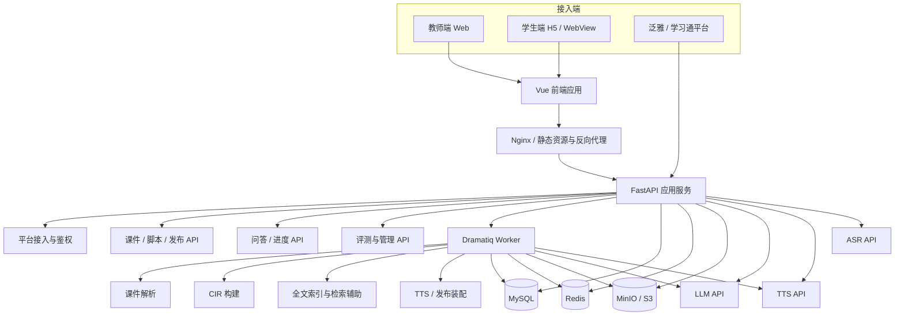
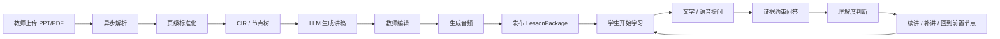

## 3. 系统总体架构

### 3.1 总体架构图

### 3.2 业务闭环图

### 3.3 运行形态定稿

该运行形态直接服务于 `requirements-analysis/` 中已经确认的主链路需求：先跑通“解析 -> 生成 -> 问答 -> 续接”的教学闭环，再保证平台接入、安全和指标证据。

正式运行形态固定为：

一个前端应用：Vue 3 + Vite，内部按教师端 / 学生端分路由与布局；

一个后端主服务：FastAPI，对外提供 /api/v1 统一接口；

一个异步 Worker：处理耗时任务；

三类基础存储：MySQL、Redis、MinIO / S3；

三类外部 AI 能力：LLM、TTS、ASR；

一套评测与监控能力：指标、日志、黄金样本、性能统计。
