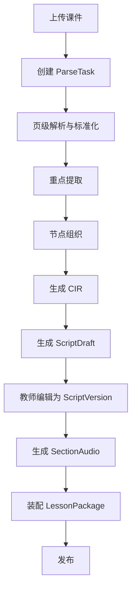
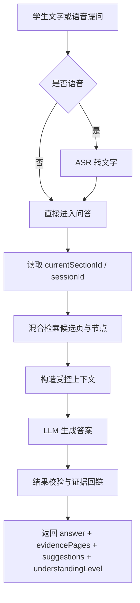

## 6. 三大核心模块正式设计

### 6.1 模块 A：智课生成

#### 目标

把 PPT / PDF 转成可教、可改、可播、可发布的智课资源。

#### 主流程



#### 模块 A 的正式输出

- `parseId`
- `structurePreview`
- `CIR`
- `ScriptDraft / ScriptVersion`
- `AudioAsset / SectionAudio`
- `PublishedLessonSnapshot / LessonPackage`

#### 设计要点

- 解析阶段先保证页级结构准确，再做智能补充；
- `structurePreview` 应在教师端可视化显示为“目录树 + 每页重点”；
- 脚本生成后必须允许教师修改，不以机器生成稿直接替代教师意图；
- 音频生成按章节切分，便于断点续播与补讲插入；
- 发布时冻结 CIR 版本、脚本版本与音频版本，形成稳定 `LessonPackage`。

这里与 `requirements-analysis/05-智课生成需求.md` 的对应关系是：架构层要承接“结构化结果、教师可编辑、音频生成、发布前置条件”四个硬需求，而不是只做课件摘要或一次性脚本生成。

### 6.2 模块 B：实时问答

#### 目标

让学生在当前学习节点上，使用文字或语音提问，并获得 证据可追溯 的回答。

#### 主流程



#### 输出约束

问答返回体在兼容开放 API 文档已有字段的基础上，正式增加以下可选字段：

- `evidencePages`: 页码列表；
- `evidenceSpans`: 证据片段列表；
- `relatedNodeIds`: 关联节点；
- `answerConfidence`: 回答可信度。

这样做的原因是：开放 API 文档强调新增字段应尽量以 非必填扩展字段 方式兼容，而赛题执行手册又要求回答必须带来源页码。因此，正式方案采用“兼容原接口、扩展可选字段”的做法。

#### 问答硬规则

- 只允许使用当前节点、相邻节点和必要前置节点的证据；
- 证据不足时必须保守回答，不做伪造扩展；
- 多轮问答只保留必要历史，避免上下文无限膨胀；
- 每次回答必须输出 `understandingLevel`，供续讲模块使用。

这里与 `requirements-analysis/06-问答交互需求.md` 的对应关系是：问答必须是“受当前章节约束的教学问答”，而不是开放式聊天能力。

### 6.3 模块 C：续接与节奏调整

#### 目标

让系统在回答完问题后，不是“停在问答页面”，而是能继续教学。

#### 内部状态机

```
normal_continue        -> 正常继续当前章节
supplement_current     -> 插入补讲，再回到当前章节
fallback_prerequisite  -> 回到前置节点补基础，再回到当前章节
accelerate_following   -> 理解充分时缩短后续非重点内容
```

#### 决策输入

- `lessonId`
- `currentSectionId`
- `QARecord`
- `understandingLevel`
- `historyQa`
- 当前节点的前置依赖与下一节点关系

#### 决策规则

- 一次性提问 + 理解充分：优先 `normal_continue`；
- 连续追问 + 部分理解：优先 `supplement_current`；
- 明显缺失前置概念：执行 `fallback_prerequisite`；
- 理解非常充分且时间受限：允许 `accelerate_following`。

#### 对外接口映射

开放 API 文档中的 progress/adjust 返回 adjustType、continueSectionId、supplementContent、nextSections。为兼容该规范，正式实现约定：

- `normal_continue` -> `adjustType = normal`
- `supplement_current` -> `adjustType = supplement`
- `fallback_prerequisite` -> `adjustType = supplement`，但 `continueSectionId` 指向前置章节，并在补讲说明中标记“前置回补”
- `accelerate_following` -> `adjustType = accelerate`

这样既对齐开放 API 文档，又满足执行手册中“跳回前置节点”的教学要求。

同时需要强调：当前轮架构主线只覆盖“继续讲、补讲、前置回补、必要时加速”这些教学闭环能力，不把 `数字人` 表现层纳入该模块主设计范围。
